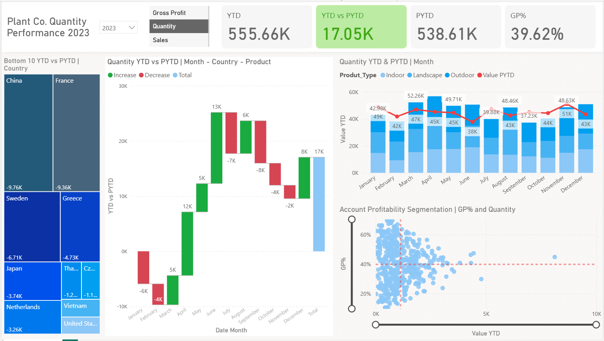
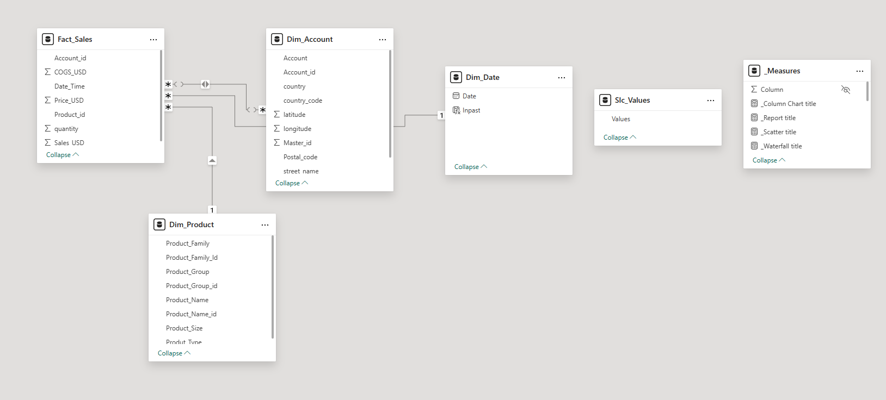

# PlantCo Performance Report: Power BI Project

## The Data Pipeline and Project Structure
The project is broken down into three main phases:

### 1. Data Ingestion & Power Query
*   **Data Sources:** We imported an Excel workbook (`Plant_DTS.xls`) containing three core tables: a fact table (`sales invoiced`) and two dimension tables (`account` and `plant hierarchy`).
*   **Cleaning & Transformation:** We renamed the tables to `fact_sales`, `dim_product`, and `dim_account` for clarity and best practices. We also removed duplicates from the unique identifier columns in the dimension tables to ensure clean relationships.
*   **Virtual Tables:** We created a custom `dim_date` table using a DAX `CALENDAR` function to cover the dataset's timeframe (2022 to April 2024). A crucial calculated column (`in_past`) was added to flag past months, ensuring accurate partial-year comparisons for Year-to-Date (YTD) and Prior Year-to-Date (PYTD) metrics.

### 2. Data Modeling & Advanced DAX
*   **Base Measures:** We built foundational measures for Sales, Quantity, Cost of Goods (COGS), and Gross Profit.
*   **Time Intelligence:** We implemented DAX measures to calculate YTD and PYTD values for all of our base metrics.
*   **Dynamic Switch Measures:** We implemented a disconnected values table to serve as a slicer (switching between Sales, Gross Profit, and Quantity). We then built switch measures that dynamically output the selected metric's YTD, PYTD, and comparison variance (YTD vs PYTD) based on the user's slicer selection.
*   **Profitability:** We created a Gross Profit Percentage (`GP%`) measure by dividing Gross Profit by Sales to track overarching company profitability at all times.

### 3. Visualization & UI/UX Design
*   **Custom Background:** We used a custom PowerPoint-designed background with an off-white base and a dedicated top section for header metrics, ensuring a clean, modern, and seamless layout.
*   **Dynamic Card Visuals:** We utilized Power BI's new card visual for the top header metrics, showcasing YTD, YTD vs PYTD, PYTD, and GP%. We applied conditional formatting to the YTD vs PYTD metrics so the font and background dynamically turn green for positive variance and red for a negative variance against the prior year.
*   **Dynamic Titles:** We implemented DAX-driven dynamic titles that automatically update based on the slicer selections (e.g., "PlantCo Sales Performance 2023" or "Quantity YTD and Prior YTD by Month") to always provide the end-user with accurate context.

## Core Visuals and Business Value
The report features several key visuals designed to provide immediate, actionable value to end-users:

*   **Variance Analysis (Waterfall Chart):** Breaks down the YTD vs PYTD variance by month, country, and product type. This allows users to drill down and see exactly which specific plant species or countries are driving major declines or areas of growth.
*   **Bottom 10 Performers (Tree Map):** Filters the bottom 10 countries based strictly on their YTD vs PYTD variance. This instantly highlights underperforming markets (like Canada, Colombia, Croatia, or Germany) that may require new sales strategies.
*   **Trend Analysis (Line and Stacked Column Chart):** Displays YTD metrics (columns) against PYTD metrics (line) on a monthly and quarterly basis, allowing users to track seasonal performance against the same period last year at a glance.
*   **Account Profitability Segmentation (Scatter Chart):** Plots individual accounts based on their Gross Profit Percentage (Y-axis) and the dynamically selected metric, such as Sales or Quantity (X-axis). We added average benchmark lines to easily segment accounts. This empowers sales teams to identify accounts with high GP% but low sales volume, allowing them to focus efforts on building rapport and driving profitable growth with those specific clients.

## DAX Functions Used
Here is the complete list of DAX methods and specific formulas used in the project, broken down by category:

*   **SUM:** Used to aggregate base data for core metrics like Sales, Quantity, and Cost of Goods (COGS).
*   **MAX:** Used to identify the maximum date in the fact table when creating the `in_past` calculated column.
*   **CALCULATE:** Used to modify the filter context to evaluate Prior Year-to-Date (PYTD) metrics.
*   **SAMEPERIODLASTYEAR:** Used within the `CALCULATE` function to shift the date context back by one year.
*   **TOTALYTD:** Used to calculate the Year-to-Date (YTD) running totals.
*   **SELECTEDVALUE:** Used to capture the user's active selection from the slicer (e.g., selecting "Sales", "Quantity", or "Gross Profit") and to extract the selected date for dynamic titles.
*   **SWITCH:** Used alongside `SELECTEDVALUE` to dynamically output different measure results depending on what the user selects in the slicer.
*   **BLANK:** Used to return an empty value as the alternative/fallback condition within the `SWITCH` measure.
*   **DIVIDE:** Used to safely divide Gross Profit by Sales to calculate the Gross Profit Percentage.
*   **YEAR:** Used to extract the specific year from a date value to populate dynamic report titles.

## Specific Formulas Constructed

### Calculated Columns
*   **`in_past`:** A boolean true/false column built using variables (`VAR`) to determine if a date is in the past by comparing the current date to the `MAX` date in the fact table minus 12 months.

### Base Measures
*   **Sales:** `sales = SUM(fact_sales[sales])`.
*   **Quantity:** `quantity = SUM(fact_sales[quantity])`.
*   **Cost of Goods (COGS):** `cost of goods = SUM(fact_sales[cogs])`.
*   **Gross Profit:** `gross profit = [sales] - [cost of goods]`.

### Time Intelligence Measures
*   **Prior Year-to-Date (PYTD):** `prior to date sales = CALCULATE([sales], SAMEPERIODLASTYEAR(dim_date[date]), dim_date[in_past] = true)`. *(Note: This same formula structure was repeated for Quantity and Gross Profit)*.
*   **Year-to-Date (YTD):** `year to date_sales = TOTALYTD([sales], fact_sales[invoice_date])`. *(Note: This same formula structure was repeated for Quantity and Gross Profit)*.

### Dynamic Slicer (Switch) Measures
*   **Dynamic PYTD:**
    ```
    VAR selected_value = SELECTEDVALUE(slicer[values])
    VAR result = SWITCH(selected_value, "sales", [prior to date sales], "quantity", [prior to date quantity], "gross profit", [prior to date gross profit], BLANK())
    RETURN result
    ```
*   **Dynamic YTD:** Built using the exact same structure as the PYTD switch, but swapping out the PYTD measures for the YTD measures.
*   **Comparison (Variance):** `year today versus prior to dat = [slicer year to date] - [slicer prior to date]`.

### Profitability Measures
*   **Gross Profit Percentage:** `GP percent = DIVIDE([gross profit], [sales])`.

### Dynamic Title Measures
*   **Visual Titles:** `waterfall title = SELECTEDVALUE(slicer[values]) & " year to date versus prior date by month country product"`.
*   **Report Title:** `report title = "PlantCo " & SELECTEDVALUE(slicer[values]) & " performance " & YEAR(SELECTEDVALUE(dim_date[date]))`.

## Getting Started
To explore this Power BI report:
1. Ensure you have Power BI Desktop installed.
2. Open the `Performance Report.pbix` file in Power BI Desktop.
3. The data source is linked to `Plant_DTS.xls`; ensure the file path is correct or update the data source if needed.
4. Interact with the slicer to switch between Sales, Quantity, and Gross Profit metrics.
5. Explore the various visuals for insights into PlantCo's performance.

## Screenshots
- **Dashboard Overview:** 
- **Data Model:** 
